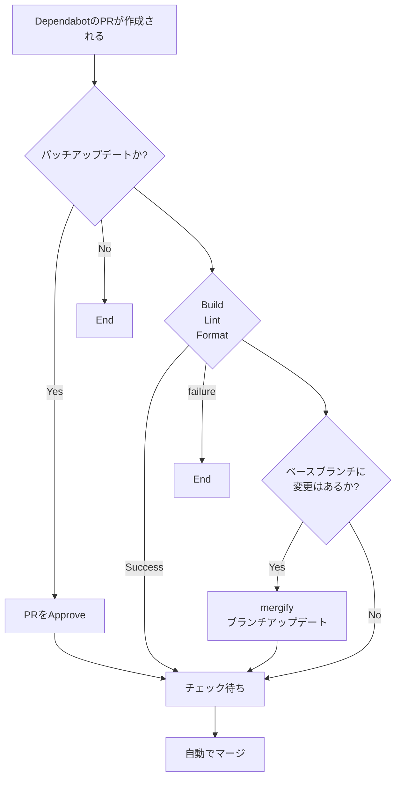

# team-generator-react

https://idaten-hack.github.io/team-generator-react/

## プロジェクトのセットアップ

```sh
git clone https://github.com/idaten-hack/team-generator-react.git
cd team-generator-react
yarn
```

## 開発サーバーの立ち上げ

```sh
yarn dev
```

## dependabot の自動マージについて


