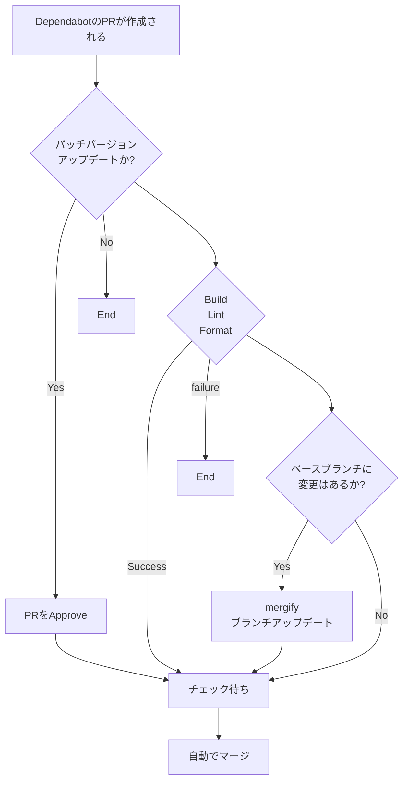

# team-generator-react

https://idaten-hack.github.io/team-generator-react/

## プロジェクトのセットアップ

```sh
git clone https://github.com/idaten-hack/team-generator-react.git
cd team-generator-react
yarn
```

## 開発サーバーの立ち上げ

```sh
yarn dev
```

## Dependabot の自動マージについて

以下の項目に全て当てはまる Dependabot の PR は自動でマージされます。

- [x] PR の作成者が `dependabot[bot]`
- [x] PR の Approve が 1 以上
- [x] パッチバージョンアップデート
- [x] ビルドテスト、リンター・フォーマットチェックに成功
- [x] ブランチが最新の状態になっている


